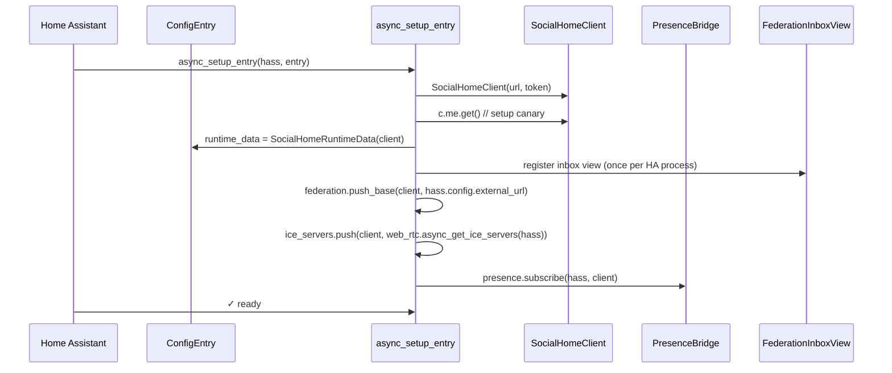

# Architecture

How the integration fits together. Distilled from §7 of `spec_work.md`
plus the current code under `custom_components/socialhome/`.

The integration is a **skeleton with already-shipped bridges** — config
flow, federation base URL push, the federation inbox HTTP view, the
STUN/TURN ICE-server push, and the presence bridge are real
implementations. Entity platforms (sensor, calendar, notify, shopping)
land in follow-up PRs; the platforms list in `const.py` is intentionally
empty for now and the polling coordinator + WS manager will come back
with the first platform that actually needs them.

## Module layout

```
custom_components/socialhome/
├── __init__.py            async_setup_entry / async_unload_entry
├── const.py               DOMAIN, platform list, option keys, defaults
├── config_flow.py         user + Hassio + reauth + options flows
├── federation.py          federation base URL push + listener
├── federation_inbox.py    /api/socialhome/inbox/{inbox_id} HTTP view
├── ice_servers.py         STUN/TURN ICE-server push + listener
├── presence.py            person.* state-change → /api/presence/location
├── manifest.json          HACS manifest — domain, version, requirements
├── strings.json           UI strings (source of truth)
└── translations/en.json   en mirror of strings.json
tests/                     pytest tree mirroring the module tree
```

## Lifecycle

`async_setup_entry` builds the runtime objects in a fixed order:



`async_unload_entry` closes the client and the federation-base /
ICE-server listeners that `entry.async_on_unload`'d themselves
during setup. The federation inbox view is registered once per HA
process and stays mounted; future entries reuse it.

## Where state lives

Exactly one place: `ConfigEntry.runtime_data`. It holds a single
`SocialHomeClient`. Everything else is either HA-owned (the `hass`
object, the entry data) or stateless per-request (the inbox view,
the federation push).

No `hass.data[DOMAIN]` dict. No module-level globals. This is what
makes unload safe: when HA tears the entry down, every reference is
dropped.

## Config flow

Three flows are registered, all in `config_flow.py`:

| Flow | When | Inputs | Validation |
|---|---|---|---|
| **User** | Standalone-mode setup | URL + API token | `GET /api/me` round-trip via `SocialHomeClient` |
| **Hassio discovery** | App-mode auto-discovery | `host` + `port` + `token` from the add-on's discovery payload (`socialhome >= 2026.5.11` reads them from `GET /addons/self/info`); URL is `http://<host>:<port>` verbatim | Same `GET /api/me` round-trip |
| **Reauth** | After `ConfigEntryAuthFailed` | Token only (URL locked) | Same |

The options flow today toggles a single feature flag:

- `sync_location` — enable / disable the presence bridge.

Future entity platforms will land their own option keys alongside
the code that reads them — pinning unused toggles in the UI invites
silent rot.

## Setup canary

`async_setup_entry` runs one `client.me.get()` round-trip before
storing the client on `runtime_data`. Mapping its errors to the
HA-standard exceptions wires the integration into HA's existing
machinery for free:

```python
try:
    await client.me.get()
except SHAuthError as e:
    raise ConfigEntryAuthFailed from e   # → re-auth flow
except SHClientError as e:
    raise ConfigEntryNotReady from e     # → automatic retry
```

The first entity platform that needs polled data will reintroduce
a `DataUpdateCoordinator`; until then there's nothing to poll, so
shipping one would just be dead code with its own failure surface.

## Federation base URL push (§7.10)

When HA's external URL changes, paired Social Home households need
to know — otherwise federation envelopes can't reach this household
through HA's reverse proxy. `federation.py` does two things:

1. On setup, push the current `hass.config.external_url` (or
   `internal_url` if external is unset) to
   `POST /api/me/federation-base`.
2. Subscribe to the `core_config_updated` bus event; on every fire,
   re-push the URL.

The push is idempotent and best-effort — a failure logs a warning
but doesn't block setup.

## STUN/TURN ICE-server push (§7.10)

The Social Home server runs behind HA's reverse proxy, so it can't
discover the operator's STUN/TURN setup on its own. HA already
aggregates that config through
`homeassistant.components.web_rtc.async_get_ice_servers(hass)`,
which returns the union of:

* `hass.config.webrtc.ice_servers` — populated from the
  `homeassistant:` block in `configuration.yaml`;
* user-YAML registered against the `web_rtc` integration;
* runtime providers — Nabu Casa Cloud registers a STUN+TURN pair
  here once the user opts in via cloud preferences.

`ice_servers.py` forwards that list to
`PUT /api/ha/integration/ice-servers` on setup and on every
`core_config_updated` fire. The push is best-effort: a transient
`SHClientError` is logged at WARN and never re-raised. The server
endpoint is idempotent — pushing an unchanged list is a no-op,
which is why we can re-push aggressively on every config-change
signal without worrying about fan-out cost.

`web_rtc` is a hard dependency in `manifest.json` so HA always
loads it before `socialhome`; we never need to guard against its
absence.

## Federation inbox view (§7.12, §11)

`federation_inbox.py` registers a public HTTP view at
`/api/socialhome/inbox/{inbox_id}`. Inbound federation envelopes
posted there are forwarded verbatim to the upstream HFS via
`SocialHomeClient.federation.forward_inbox_envelope()` — body bytes,
status code, content-type all proxied without parsing. The
integration is a transparent relay; it never inspects envelope
contents.

This view is registered **once per HA process**. Multi-account
setups (one HA → two Social Home instances) use the inbox-id path
parameter to route to the right runtime client.

## Presence bridge (§7.3)

`presence.py` subscribes to `state_changed` events for `person.*`
entities and forwards qualifying updates to
`POST /api/presence/location`. Three gates protect the user before
any GPS coordinate leaves HA:

1. **Accuracy cap:** drop coordinates with `gps_accuracy_m > 500`
   (still push the zone so automations keep working).
2. **Distance dedup:** skip if the new position is within 50 m of
   the last forwarded position (haversine).
3. **4dp truncation:** `round(float(lat), 4)` before the API call —
   matches the §4 invariant on the Social Home side.

The bridge is enabled / disabled by the `sync_location` option;
toggling the option re-subscribes / unsubscribes without reloading
the entry.

## Where things live

| Concern | Path |
|---|---|
| Setup / unload entry | `custom_components/socialhome/__init__.py` |
| Domain constants | `custom_components/socialhome/const.py` |
| Config flow + options | `custom_components/socialhome/config_flow.py` |
| Federation base URL | `custom_components/socialhome/federation.py` |
| Federation inbox view | `custom_components/socialhome/federation_inbox.py` |
| STUN/TURN ICE servers | `custom_components/socialhome/ice_servers.py` |
| Presence bridge | `custom_components/socialhome/presence.py` |
| Tests (mirror layout) | `tests/` |

Future platform modules (`sensor.py`, `calendar.py`, `notify.py`,
`shopping_list.py`) plug in by adding to `PLATFORMS` in `const.py`
and forwarding from `__init__.py`. Whichever lands first
reintroduces the polling coordinator + the matching options
toggle.

## Spec references

- §7 — repository overview
- §7.1 — `manifest.json` shape
- §7.2 — config flow
- §7.3 — presence bridge (GPS gates)
- §7.4 — shopping list bridge (queued)
- §7.5 — calendar bridge (queued)
- §7.6 — push notification bridge (queued)
- §7.7 — sensor platform (queued)
- §7.8 — SH → HA automation events (queued)
- §7.9 — WebSocket reconnect strategy (delegated to `socialhome-client`)
- §7.10 — federation base URL push + integration requirements
- §7.11 — setup, unload, cleanup lifecycle
- §7.12 — federation inbox bridge
